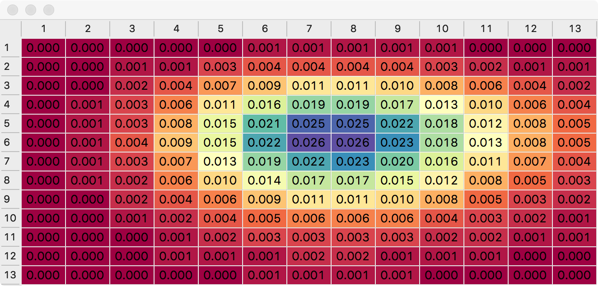

# Version 3 - Numpy (Poisson) probability space.

Probability space visualization with data generated using SciPy / Numpy.

Qt UI updated to used Model/View with StyledDelegate to carry out 
colour coding.

