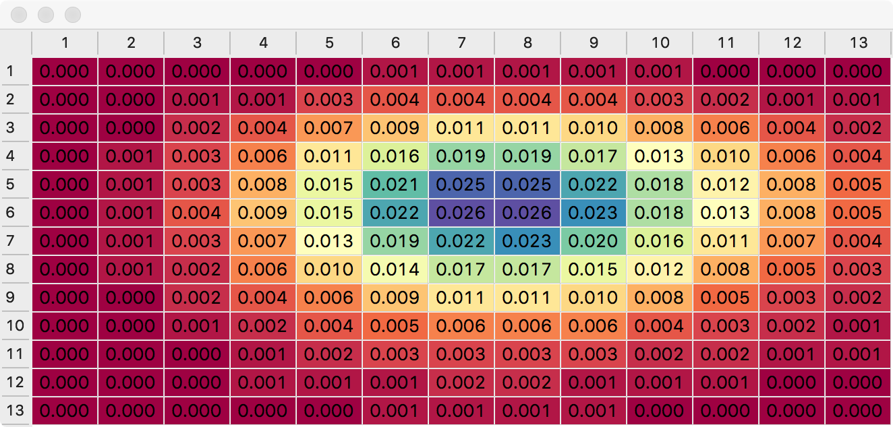

# Version 4 - Numpy (Poisson) probability space with simulated updates.

Probability space visualization with data generated using SciPy / Numpy.

Qt UI updated to use Model/View with StyledDelegate to carry out 
colour coding.

A generator is used to produce updated home and away goal expectations 
based on brownian motion. 

