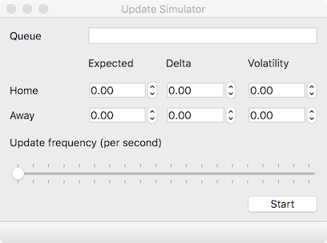

# Version 5 - message queue visualization [In Progress]

This version separates out the functionality.

A separate simulator (see below) is used to generate update messages
at a given frequency and behaviour.

The messages are published to a NATS message queue and can then
be picked up by a number of subscribers including:

1. A wiretap showing the raw messages.
2. A probability space heatmap visualization.

It would be trivial to extend the example with additional
event stream processors.